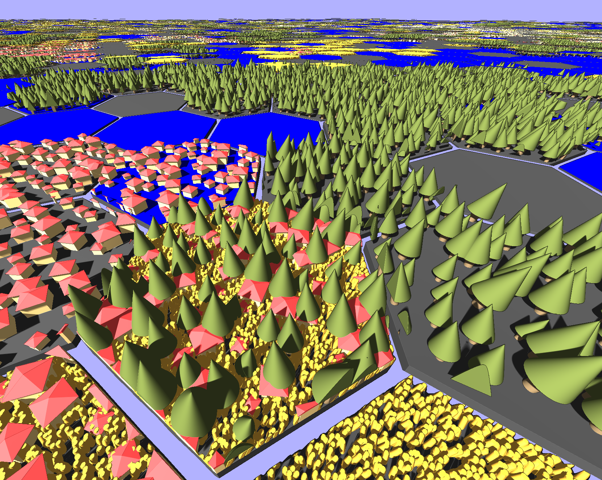

# Dorfromantische-rs

A reimplementation of dorfromantischer (python/opengl, see git history) in Rust/vulkan.

Uses a mixture of raytracing, raymarching and custom logic to render huge 2d maps kinda efficiently in 3D.

